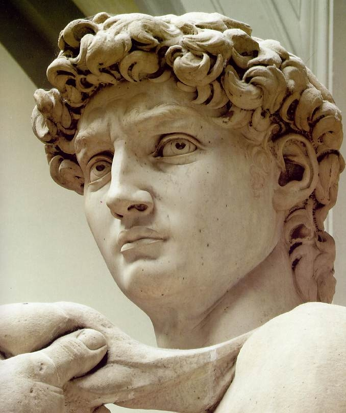
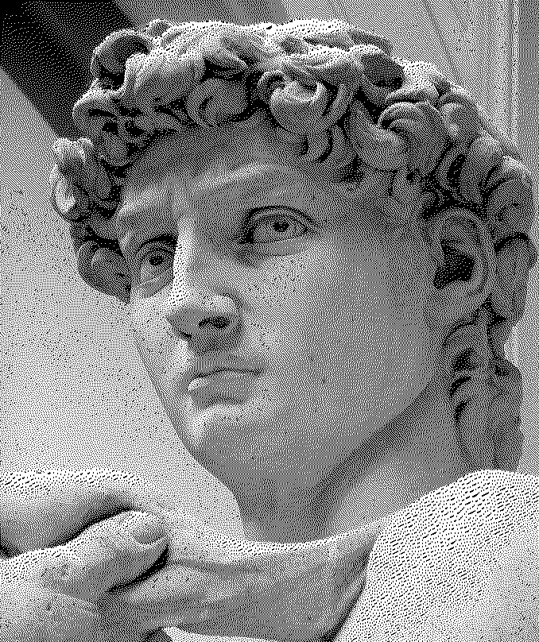
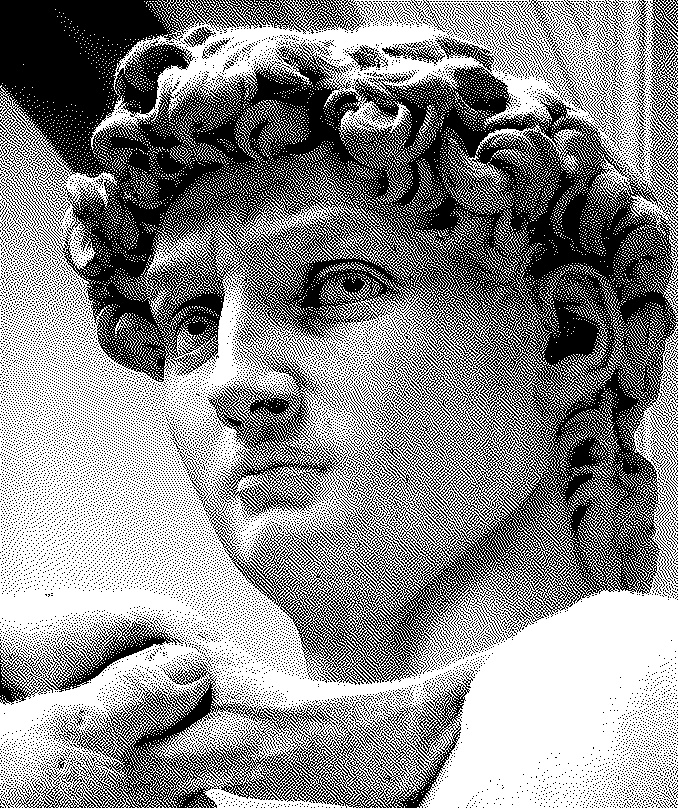

# Image Dithering

## Basic Principle

Dithering using error diffusion pushes (adds) the residual quantization error 
of a pixel onto its neighboring pixels.  The algorithm scans the image from top 
to bottom and from left to right, quantizing pixel values one by one.

## Floyd-Steinberg Dithering
```
[              *    7/16  ... ]
[  ...  3/16  5/16  1/16  ... ]
```
The pixel indicated with an asterisk is the pixel currently being scanned.

## Atkinson Dithering 
A variant of Floyd-Steinberg dithering by Bill Atkinson.
```
[             *   1/8  1/8  ]
[  ...  1/8  1/8  1/8  ...  ]
[  ...       1/8       ...  ]
```
In this variant, only 3/4 of the error is diffused, which leads to a more localized
dither at the cost of lower performance in almost saturated region.
This results in increased contrast and may be more desirable visually.

## Comparison 
Original image (from Internet):



Floyd-Steinberg dithering:



Atkinson dithering:


